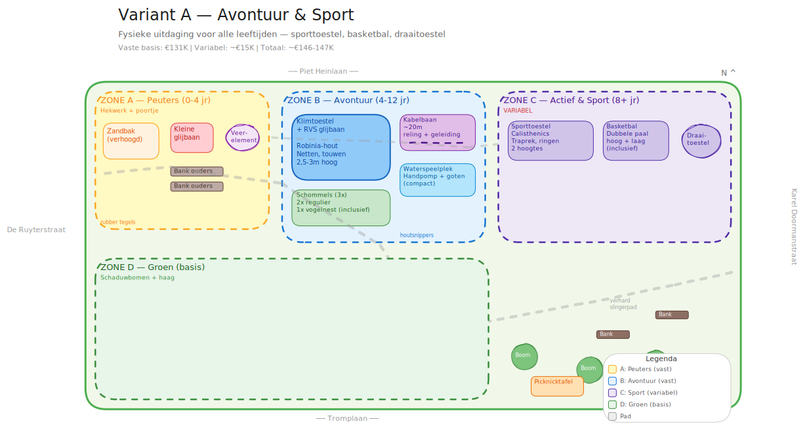
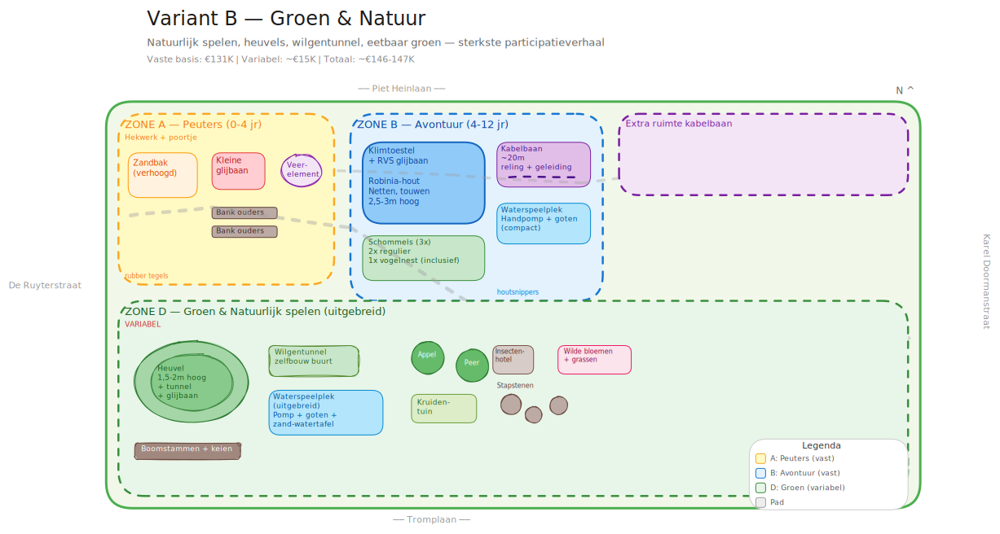
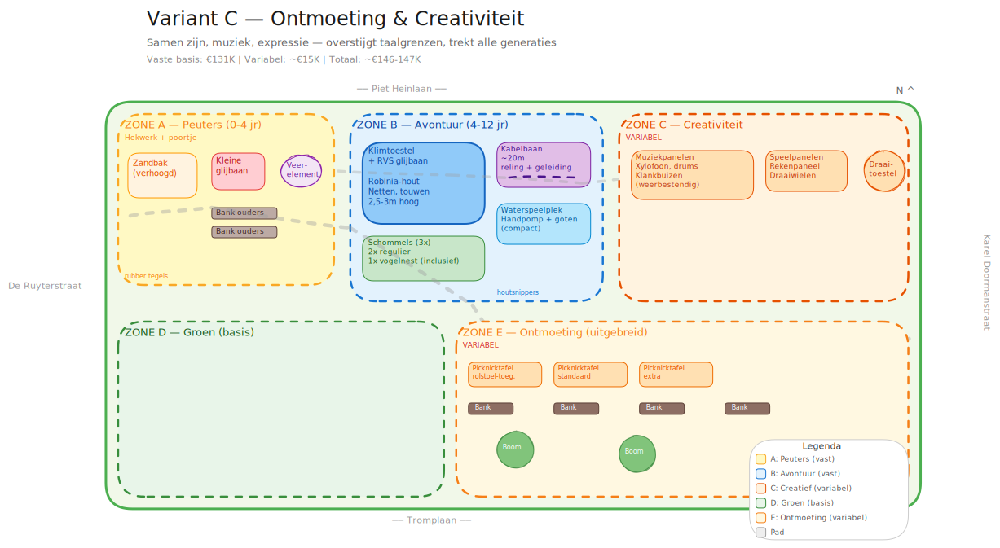
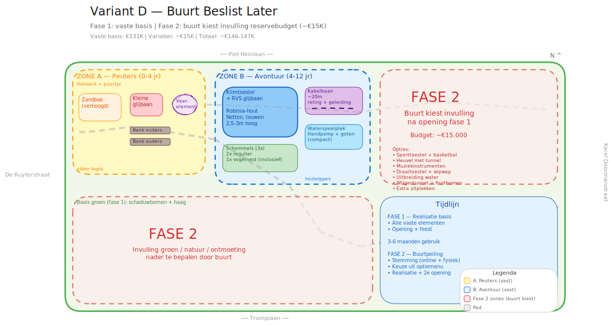

<!-- _class: title -->
<!-- _paginate: skip -->

# Samenspeelplek Karel Doormanstraat

Variantenstudie — ter bespreking kernteam

Nijkerk, april 2026

---

<!-- _class: compact -->

# Waar staan we?

### Traject tot nu toe
- Enquete gehouden (63 respondenten, 236 adressen)
- Gesprek met gemeente en Samenspeelfonds
- Kernteam gevormd (8 betrokkenen)
- Wachten op groen licht gemeente

### Het terrein
- **~1.200 m²** (ca. 50m x 25m)
- Begrensd door Piet Heinlaan, Tromplaan, De Ruyterstraat en Karel Doormanstraat

### Budget
| Bron | Bedrag |
|---|---|
| Gemeente | ~€70.000 |
| Samenspeelfonds | €50.000 (mits stichting) |
| Overige fondsen | €15.000 - €30.000 |
| **Totaal beschikbaar** | **€150.000 - €170.000** |

> 75% van het Samenspeelfonds wordt vooraf uitbetaald — dit is het startkapitaal

---

<!-- _class: compact -->

# Wat wil de buurt?

### Meest gevraagde toestellen

| Toestel | Score |
|---|---|
| Glijbaan | **75%** |
| Klimtoestel | **73%** |
| Schommel | **71%** |
| Peuterzone | **60%** |
| Kabelbaan | 46% |
| Waterspeelplek | 41% |
| Sporttoestellen | 32% |
| Creatieve opties | 24% |

### Belangrijkste waarden

| Waarde | Score |
|---|---|
| Inclusiviteit | **35%** |
| Uitdagend spelen | 19% |
| Veiligheid | 18% |
| Veel groen | 13% |
| Ontmoeting | 10% |

### Huidige beoordeling
**68%** geeft de huidige speeltuin een **1 of 2** op 5

**0%** wil niet meehelpen — iedereen staat open voor betrokkenheid

---

<!-- _class: compact -->

# Hoe werkt deze variantenstudie?

### Vaste basis €131.000
Alles met **>60% steun** staat vast in elke variant:

- Klimtoestel met RVS glijbaan *(Robinia)*
- 3 schommels *(incl. vogelnest — inclusief)*
- Kabelbaan ~20m
- Peuterzone *(afgeschermd, zandbak, glijbaan)*
- Waterspeelplek *(compact)*
- Verharde slingerpaden
- Basisgroen en bankjes
- Installatie, keuring en ontwerp

### Variabel budget ~€15.000
Het verschil tussen de varianten zit in hoe dit budget wordt besteed.

**Vier varianten, vier karakters:**

| | Variant | Karakter |
|---|---|---|
| **A** | Avontuur & Sport | Fysieke uitdaging |
| **B** | Groen & Natuur | Natuurlijk spelen |
| **C** | Ontmoeting & Creativiteit | Samen zijn |
| **D** | Buurt Beslist Later | Participatie |

> Geen variant is "beter" — het gaat om: **wat voor plek willen we zijn?**

---

<!-- _class: divider -->
<!-- _paginate: skip -->

# De vier varianten

---

<!-- _class: variant-a compact -->

# Variant A — Avontuur & Sport

> *"Een plek waar je jezelf uitdaagt"*

### Extra elementen variabel

| Element | Budget |
|---|---|
| Sporttoestel / calisthenics | €7.000 |
| Basketbalpaal dubbel | €3.000 |
| Draaitoestel | €3.000 |
| Extra grondverzet | €2.000 |
| **Subtotaal variabel** | **€15.000** |
| **Totaal variant A** | **~€146.000** |

### Sterk punt
- Trekt ook **tieners en volwassenen** — minder "hangplek"-risico
- Sporttoestel telt als **inclusief element** (extra subsidie SSF)

### Aandachtspunt
- Minder groen
- Mogelijke geluidsoverlast basketbal

---

<!-- _class: variant-a plattegrond -->

# Variant A — Plattegrond

---

<!-- _class: variant-b compact -->

# Variant B — Groen & Natuur

> *"Een plek die leeft en meegroeit"*

### Extra elementen variabel

| Element | Budget |
|---|---|
| Heuvel met tunnel + glijbaan | €6.000 |
| Wilgentunnel (NL Doet) | €800 |
| Uitbreiding waterspeelplek | €3.000 |
| Fruitbomen + kruidentuin | €2.000 |
| Boomstammen, keien | €1.500 |
| Insectenhotel | €700 |
| Wilde bloemen | €2.000 |
| **Subtotaal variabel** | **€16.000** |
| **Totaal variant B** | **~€147.000** |

### Sterk punt
- **Sterkste fondsen-verhaal** (SSF, VSBfonds, Springzaad)
- Bouwdagen leveren **cofinanciering** op (vrijwilligersuren a €30/u)
- Laagste onderhoudskosten lange termijn

---

<!-- _class: variant-b plattegrond -->

# Variant B — Plattegrond

---

<!-- _class: variant-c compact -->

# Variant C — Ontmoeting & Creativiteit

> *"Een plek waar je elkaar vindt"*

### Extra elementen variabel

| Element | Budget |
|---|---|
| Buitenmuziekinstrumenten (4x) | €5.000 |
| Draaitoestel / carrousel | €3.000 |
| Extra picknicktafels (2x) | €2.500 |
| Extra bankjes (4x) | €2.000 |
| Schaduwbomen (2 extra) | €1.500 |
| Speelpanelen (educatief) | €2.000 |
| **Subtotaal variabel** | **€16.000** |
| **Totaal variant C** | **~€147.000** |

### Sterk punt
- Muziek **overstijgt taalgrenzen** — past bij multiculturele buurt
- Sterkste **sociale functie**: ouders en grootouders verblijven langer
- Uniek in Nijkerk

---

<!-- _class: variant-c plattegrond -->

# Variant C — Plattegrond

---

<!-- _class: variant-d compact -->

# Variant D — Buurt Beslist Later

> *"Samen bouwen, stap voor stap"*

### Aanpak

| Fase | Wat | Budget |
|---|---|---|
| **Fase 1** | Vaste basis realiseren | €131.000 |
| *3-6 mnd* | *Ervaring opdoen* | |
| **Fase 2** | Buurt kiest invulling | €15.000 |
| **Totaal** | | **~€146.000** |

### Sterk punt
- **Maximale participatie** — buurt beslist echt mee
- Twee "momenten" voor publiciteit en fondswerving

### Optiemenu fase 2 (buurt kiest)
- Sporttoestel + basketbal (~€10K)
- Heuvel met tunnel (~€6K)
- Muziekpanelen (~€5K)
- Wilgentunnel + fruitbomen (~€4,5K)
- Extra zitplekken (~€4,5K)

---

<!-- _class: variant-d plattegrond -->

# Variant D — Plattegrond

---

<!-- _class: compare compact -->

# Vergelijking in een oogopslag

| | **A: Avontuur & Sport** | **B: Groen & Natuur** | **C: Ontmoeting** | **D: Buurt Beslist** |
|---|---|---|---|---|
| **Accent** | Fysieke uitdaging | Natuurlijk spelen | Samen & expressie | Participatie |
| **Totaal** | ~€146K | ~€147K | ~€147K | ~€146K |
| **Uniek** | Calisthenics + basketbal | Heuvel + wilgentunnel | Muziekinstrumenten | Gereserveerd budget |
| **Doelgroep extra** | Tieners, volwassenen | Natuur-minded gezinnen | Multicultureel, ouderen | Hele buurt kiest |
| **Fondsen-verhaal** | Sport & preventie | Groen & participatie | Inclusie & leefbaarheid | Co-creatie |
| **Risico** | Geluidsoverlast | Groeitijd groen | Geluidsoverlast muziek | Twee bouwfases |

> Combineren kan ook — bv. het groene karakter van B met muziekpanelen uit C, of variant D met een groen accent in fase 1.

---

<!-- _class: compact -->

# Vervolgstappen

### Na keuze kernteam
1. Gekozen richting voorleggen aan bredere groep
2. Eventueel stemming (online + fysiek)
3. Definitieve variant meenemen in professioneel ontwerp

### Na groen licht gemeente
4. Stichting formeel oprichten
5. Samenspeelfonds-aanvraag indienen
6. Fondswervingsplan uitwerken
7. Offertes aanvragen bij leveranciers

### Realisatie
8. Bouwdag(en) organiseren *(NL Doet / Burendag)*
9. Professionele installatie toestellen
10. Veiligheidskeuring (WAS)
11. **Opening!**

### Leveranciers om te benaderen
- **Robinia / natuurlijk:** Acacia-Robinia, Goede Speelprojecten
- **Breed:** Nijha, Kompan, IJslander, Lappset
- **Kennis:** Jantje Beton, Stichting Springzaad

> Vraag minimaal 3 offertes per categorie

---

<!-- _class: title -->
<!-- _paginate: skip -->

# Welke plek willen we zijn?

Laten we het gesprek voeren.

Samenspeelplek Karel Doormanstraat — Nijkerk
